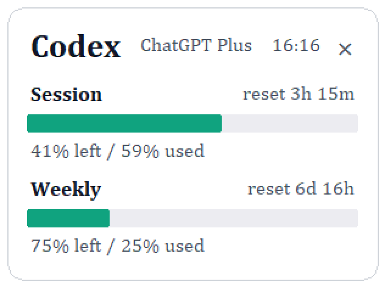

# codex-only-float

A small Windows floating window for checking Codex usage.

This project is designed for Codex users who want a lightweight way to monitor usage without repeatedly checking manually.

It is intentionally minimal: one compact always-on-top Tkinter window, Codex-only data, no provider system, no browser cookie extraction, and no background service.

## Preview



## What it solves

Codex usage can be easy to miss when users need to check it manually. This project provides a small always-on-top window that keeps session and weekly usage visible while Codex is running.

## Features

- Shows Codex session and weekly usage.
- Refreshes automatically every 60 seconds.
- Reads existing Codex login data from the normal local Codex auth file.
- Uses the ChatGPT/Codex usage endpoint.
- Keeps credentials in memory only; it does not save tokens, cookies, or account IDs.
- Can launch Codex first, then automatically open the floating window.
- Closes itself when the Codex desktop app is closed.

## Quick Start

Run only the floating window:

```powershell
powershell -ExecutionPolicy Bypass -File .\run.ps1
```

Launch Codex and then open the floating window:

```powershell
powershell -ExecutionPolicy Bypass -File .\launch_codex_with_float.ps1
```

## Requirements

- Windows
- Python 3.10 or newer
- Codex desktop app already installed and logged in

No third-party Python packages are required.

The app creates/updates `config.json` locally for window position, theme, and refresh interval. This file is ignored by git and should not be committed.

## Privacy and Safety

This project reads the local Codex auth file only to call the usage endpoint. It does not modify that file, and it does not print, log, copy, or persist credentials.

The usage endpoint is an internal ChatGPT/Codex endpoint. It may change or stop working without notice.

## Roadmap

- Provide a packaged Windows executable release.
- Improve error handling when the Codex usage endpoint fails.
- Add an optional Windows login startup flow.
- Improve setup documentation and troubleshooting notes.
- Keep the app lightweight, local-first, and Codex-only.

## Attribution

Inspired by [Win-CodexBar](https://github.com/Finesssee/Win-CodexBar) and the original CodexBar. This repository is an independent Python/Tkinter implementation and does not copy their source code.

## License

MIT
